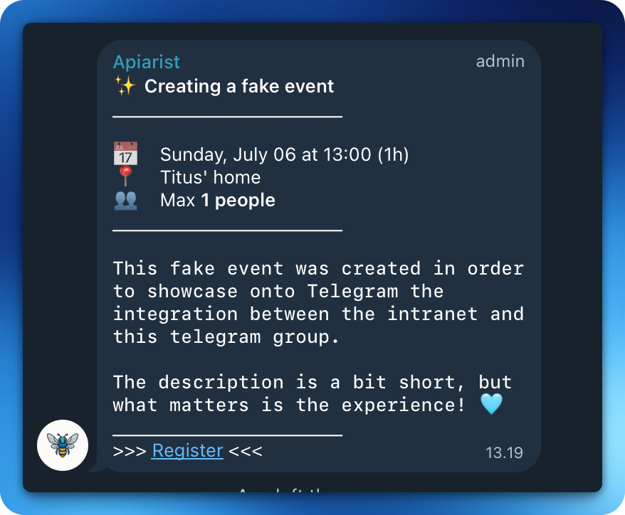

<div align="center">
    <br />
    <h1 align="center">Intra Events Bot</h1>
    <sub><em>Your friendly campus companion, buzzing with updates!</em></sub>
</div>

<div align="center">
  <sub>Created by <a href="https://github.com/jgengo">Jordane Gengo</a></sub>
</div>

<br /><br />


> [!IMPORTANT]<br> **Webhook creation is restricted to 42 staff members only. This feature is designed for official campus communications.**

<br>

A FastAPI application that receives webhooks from the 42 intranet and publishes events to a Telegram group, keeping students updated about new events in real-time.

<div align="center">
 <br />
</div><br />

## Purpose

This application serves as a bridge between the 42 intranet system and Telegram, automatically notifying students about:
- New events created
- Event cancellations
- New exam sessions created

## Architecture

```
42 Intra → Webhook → FastAPI → Telegram Bot → Student Group
```

The application consists of:
- **Webhook endpoints**: Receive event notifications from the 42 intranet
- **Telegram client**: Publish formatted messages to your Telegram group
- **Health monitoring**: Ensure the service is running properly
- **Error handling**: Graceful handling of webhook failures

## Quick Start

### Prerequisites

- Python 3.12+
- Telegram Bot Token (from [@BotFather](https://t.me/botfather))
- Telegram Group ID where notifications will be sent

### Installation

1. **Clone the repository**
   ```bash
   git clone <your-repo-url>
   cd intra-events-notify
   ```

2. **Install dependencies**
   ```bash
   uv sync
   ```

3. **Set up environment variables**
   ```bash
   cp .env.sample .env
   ```
   
   Edit `.env` with your configuration:
   ```env
   # Environment
   ENV=local
   
   # Telegram Configuration
   TELEGRAM_BOT_TOKEN=your_bot_token_here
   TELEGRAM_GROUP_ID=your_group_id_here
   
   # Webhook Security
   WEBHOOK_SECRET=your_webhook_secret_here
   ```

4. **Run the application**
   ```bash
   uv run uvicorn app.main:app --reload
   ```

The API will be available at `http://localhost:8000`

### Testing Webhooks

With the server running, you can test webhook functionality locally using the provided scripts:

#### Test Event Creation
```bash
sh scripts/fake_create_webhook.sh
```

This script posts a sample event creation payload to `http://localhost:8000/webhooks/events` using the `WEBHOOK_SECRET` from your `.env` file.

#### Test Event Deletion
```bash
sh scripts/fake_destroy_webhook.sh
```

This script posts a sample event deletion payload to `http://localhost:8000/webhooks/events` to test the delete event functionality.

#### Test Exam Creation
```bash
sh scripts/fake_create_exam_webhook.sh
```

This script posts a sample exam creation payload to `http://localhost:8000/webhooks/exams`.

All scripts use the same authentication mechanism and endpoint, but with different event types to simulate real intranet webhook behavior.

## API Endpoints

### Health Check
- `GET /health` - Check if the service is running

### Webhooks
- `POST /webhooks/events` - Receive event notifications from intranet
- `POST /webhooks/exams` - Receive exam notifications from intranet

### API Documentation
- `GET /docs` - Interactive API documentation (Swagger UI)
- `GET /redoc` - Alternative API documentation

## Configuration

### Environment Variables

| Variable | Description | Required | Default |
|----------|-------------|----------|---------|
| `ENV` | Environment (local, development, test, production) | Yes | `local` |
| `TELEGRAM_BOT_TOKEN` | Your Telegram bot token | Yes | - |
| `TELEGRAM_GROUP_ID` | Target Telegram group ID | Yes | - |
| `WEBHOOK_EVENT_SECRET` | Secret for events' webhooks  | Yes | - |
| `WEBHOOK_EXAM_SECRET` | Secret for exam's webhooks | Yes | - |

### Telegram Setup

1. **Create a bot** via [@BotFather](https://t.me/botfather)
2. **Add the bot to your group** and make it an admin
3. **Get the group ID** by sending a message and checking `https://api.telegram.org/bot<BOT_TOKEN>/getUpdates`

## Webhook Format

The 42 intranet should send POST requests to `/webhooks/events` and `/webhooks/exams` with the following headers and format:

### Headers
- `Content-Type: application/json`
- `X-Secret: {webhook_secret}` - Authentication secret
- `X-Model: {model_type}` - Either "event" or "exam"
- `X-Event: {event_type}` - Either "create" or "destroy"
- `X-Delivery: {delivery_id}` - Unique delivery identifier

### Event Webhook Payload (`/webhooks/events`)
```json
{
  "id": 33480,
  "begin_at": "2025-07-09 18:00:00 UTC",
  "end_at": "2025-07-09 19:00:00 UTC",
  "name": "🩵 Running just a test",
  "description": "I'm sorry for the ping, just running one last test.",
  "location": "Titus' Boiler Room",
  "kind": "conference",
  "max_people": 1,
  "prohibition_of_cancellation": null,
  "campus_ids": [13],
  "cursus_ids": [1],
  "created_at": "2025-07-09 17:36:23 UTC",
  "updated_at": "2025-07-09 17:36:23 UTC"
}
```

### Exam Webhook Payload (`/webhooks/exams`)
```json
{
  "id": 24484,
  "begin_at": "2025-07-09 18:00:00 UTC",
  "end_at": "2025-07-09 19:00:00 UTC",
  "location": "Jordane's home",
  "ip_range": "10.13.1.1/16",
  "max_people": 1,
  "visible": false,
  "name": "Exam",
  "campus_id": 13,
  "created_at": "2025-07-09 17:24:14 UTC",
  "updated_at": "2025-07-09 17:24:14 UTC",
  "projects": [
    {
      "name": "Exam Rank 02",
      "id": 1320,
      "slug": "exam-rank-02",
      "url": "https://projects.intra.42.fr/exam-rank-02/mine"
    }
  ]
}
```

### Event Types

The webhook system supports the following event types:

#### Event Webhooks (`/webhooks/events`)
- `create` - New event created
- `destroy` - Event cancelled/deleted

#### Exam Webhooks (`/webhooks/exams`)
- `create` - New exam session created
<!-- - `destroy` - Exam session cancelled/deleted  -->


## Development

### Code Quality

This project uses several tools for code quality:

```bash
# Format code
uv run black app/
uv run isort app/

# Lint code
uv run ruff check app/
uv run mypy app/

# Run all checks
uv run ruff check app/ && uv run mypy app/
```

### Project Structure

```
app/
├── main.py              # FastAPI application entry point
├── health/              # Health check endpoints
│   ├── api.py
│   └── api_formats.py
├── services/            # Business logic services
│   └── telegram_client.py
└── webhooks/           # Webhook endpoints
    ├── api.py
    └── api_formats.py
```

## Deployment

### Docker (Recommended)

1. **Build the Docker image**
   ```bash
   docker build -t intra-events-notify .
   ```

2. **Run with environment variables**
   ```bash
   docker run -d \
     --name intra-events-bot \
     -p 8000:8000 \
     -e TELEGRAM_BOT_TOKEN=your_bot_token_here \
     -e TELEGRAM_GROUP_ID=your_group_id_here \
     -e WEBHOOK_EVENT_SECRET=your_event_webhook_secret_here \
     -e WEBHOOK_EXAM_SECRET=your_exam_webhook_secret_here \
     -e TZ=Europe/Helsinki \
     -e ENV=production \
     intra-events-notify
   ```

3. **View logs**
   ```bash
   # Follow logs in real-time
   docker logs -f intra-events-bot
   ```

4. **Stop the container**
   ```bash
   docker stop intra-events-bot
   docker rm intra-events-bot
   ```

### Environment Setup

1. Set up your environment variables
2. Configure your webhook URL in the 42 intranet
3. Ensure your Telegram bot has proper permissions

## Security

- Webhook endpoints should be protected with authentication
- Use HTTPS in production
- Validate all incoming webhook data
- Rate limit webhook endpoints to prevent abuse


## Contributing

1. Fork the repository
2. Create a feature branch
3. Make your changes
4. Run tests and linting
5. Submit a pull request

## License

This project is licensed under the MIT License - see the [LICENSE](LICENSE) file for details.

## About

Created by [Jordane Gengo](https://github.com/jgengo)