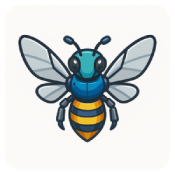

<div align="center">
    <br />
    <h1 align="center">Intra Events Bot</h1>
    <sub><em>Your friendly campus companion, buzzing with updates!</em></sub>
</div>

<div align="center">
  <sub>Created by <a href="https://github.com/jgengo">Jordane Gengo</a></sub>
</div>

<br /><br />


> [!IMPORTANT]<br> Webhook creation is restricted to 42 staff members *only*. This feature is designed for official campus communications.

A FastAPI application that receives webhooks from the 42 intranet and publishes events to a Telegram group, keeping students updated about new events in real-time.

## Purpose

This application serves as a bridge between the 42 intranet system and Telegram, automatically notifying students about:
- New events created
- Event updates
- Event cancellations
- Location changes
- Time modifications

## Architecture

```
42 Intra → Webhook → FastAPI → Telegram Bot → Student Group
```

The application consists of:
- **Webhook endpoints**: Receive event notifications from the 42 intranet
- **Telegram client**: Publish formatted messages to your Telegram group
- **Health monitoring**: Ensure the service is running properly
- **Error handling**: Graceful handling of webhook failures

## Quick Start

### Prerequisites

- Python 3.12+
- Telegram Bot Token (from [@BotFather](https://t.me/botfather))
- Telegram Group ID where notifications will be sent

### Installation

1. **Clone the repository**
   ```bash
   git clone <your-repo-url>
   cd intra-events-notify
   ```

2. **Install dependencies**
   ```bash
   uv sync
   ```

3. **Set up environment variables**
   ```bash
   cp .env.example .env
   ```
   
   Edit `.env` with your configuration:
   ```env
   TELEGRAM_BOT_TOKEN=your_bot_token_here
   TELEGRAM_GROUP_ID=your_group_id_here
   WEBHOOK_SECRET=your_webhook_secret_here
   ```

4. **Run the application**
   ```bash
   uv run uvicorn app.main:app --reload
   ```

The API will be available at `http://localhost:8000`

## API Endpoints

### Health Check
- `GET /health` - Check if the service is running

### Webhooks
- `POST /webhooks/events` - Receive event notifications from intranet

### API Documentation
- `GET /docs` - Interactive API documentation (Swagger UI)
- `GET /redoc` - Alternative API documentation

## Configuration

### Environment Variables

| Variable | Description | Required |
|----------|-------------|----------|
| `TELEGRAM_BOT_TOKEN` | Your Telegram bot token | Yes |
| `TELEGRAM_GROUP_ID` | Target Telegram group ID | Yes |
| `WEBHOOK_SECRET` | Secret for webhook authentication | Yes |
| `SENTRY_DSN` | Sentry DSN for error tracking | No |

### Telegram Setup

1. **Create a bot** via [@BotFather](https://t.me/botfather)
2. **Add the bot to your group** and make it an admin
3. **Get the group ID** by sending a message and checking `https://api.telegram.org/bot<BOT_TOKEN>/getUpdates`

## Webhook Format

The 42 intranet should send POST requests to `/webhooks/events` with this format:

-- TODO

### Event Types

-- TODO 
<!-- - `created` - New event
- `updated` - Event modified
- `deleted` - Event cancelled
- `reminder` - Event reminder -->

## Development

### Code Quality

This project uses several tools for code quality:

```bash
# Format code
uv run black app/
uv run isort app/

# Lint code
uv run ruff check app/
uv run mypy app/

# Run all checks
uv run ruff check app/ && uv run mypy app/
```

### Project Structure

```
app/
├── main.py              # FastAPI application entry point
├── health/              # Health check endpoints
│   ├── api.py
│   └── api_formats.py
├── services/            # Business logic services
│   └── telegram_client.py
└── webhooks/           # Webhook endpoints
    ├── api.py
    └── api_formats.py
```

## Deployment

### Docker (Recommended)

```dockerfile
FROM python:3.12-slim

WORKDIR /app
COPY . .

RUN pip install uv
RUN uv sync --frozen

EXPOSE 8000
CMD ["uv", "run", "uvicorn", "app.main:app", "--host", "0.0.0.0", "--port", "8000"]
```

### Environment Setup

1. Set up your environment variables
2. Configure your webhook URL in the 42 intranet
3. Ensure your Telegram bot has proper permissions

## Security

- Webhook endpoints should be protected with authentication
- Use HTTPS in production
- Validate all incoming webhook data
- Rate limit webhook endpoints to prevent abuse


## Contributing

1. Fork the repository
2. Create a feature branch
3. Make your changes
4. Run tests and linting
5. Submit a pull request

## License

This project is licensed under the MIT License - see the [LICENSE](LICENSE) file for details.

## About

Created by [Jordane Gengo](https://github.com/jgengo)